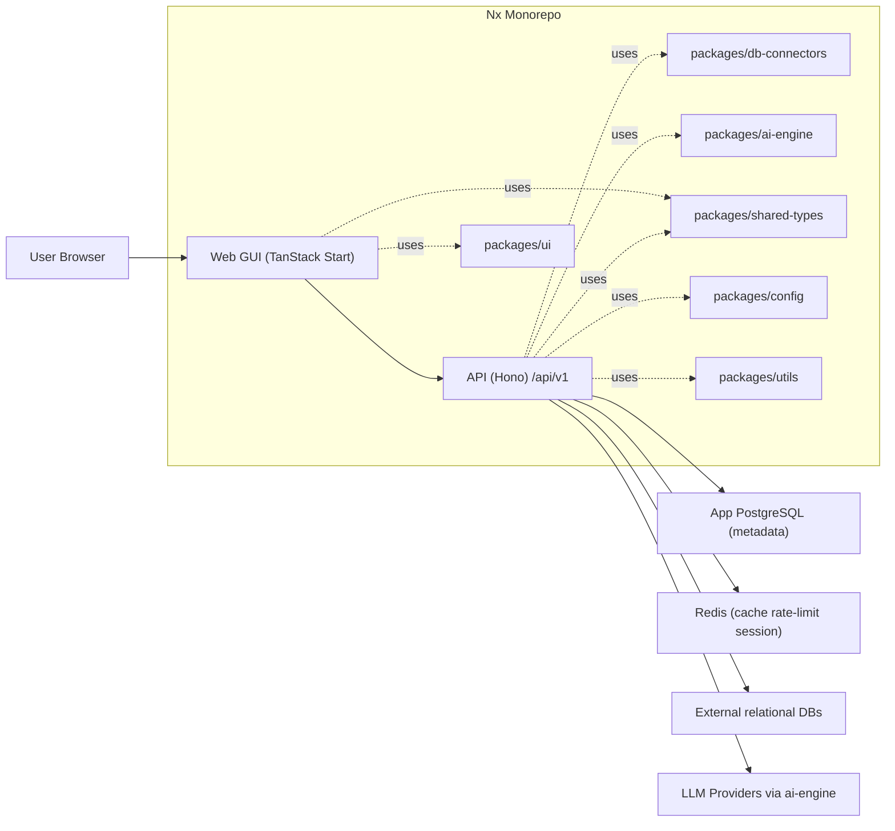
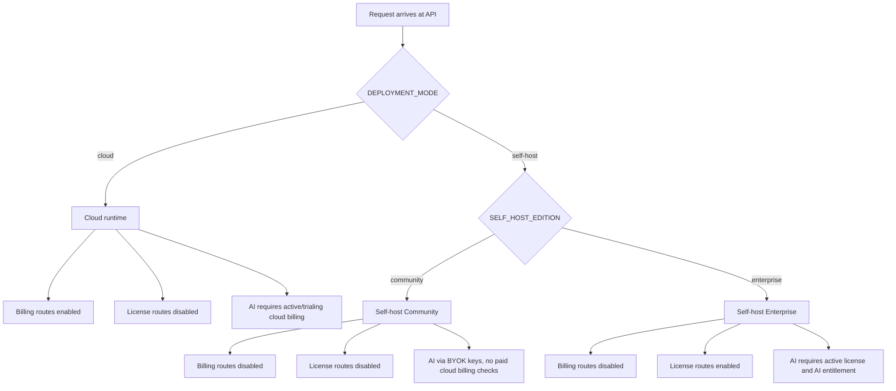
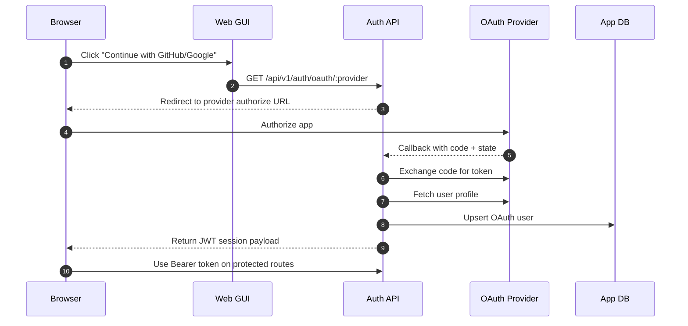
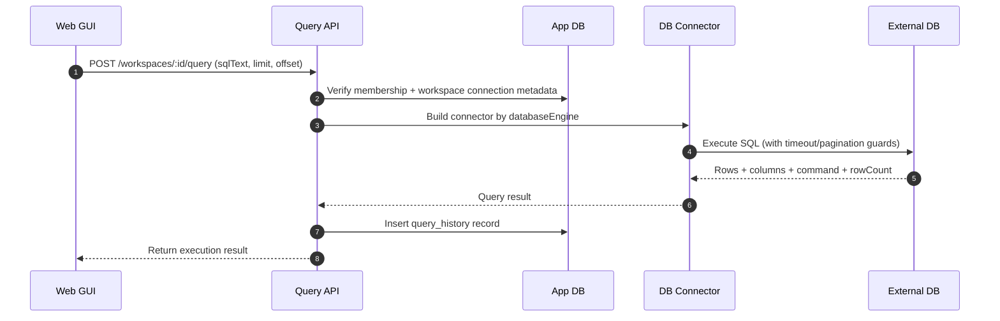
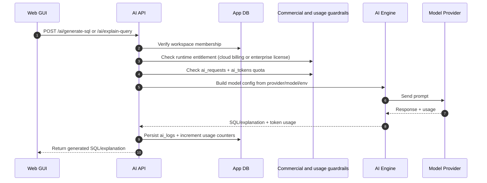
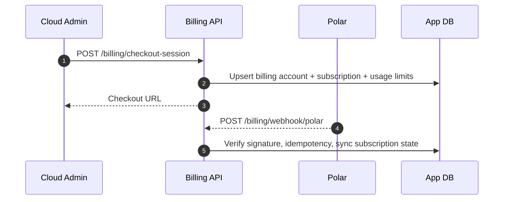
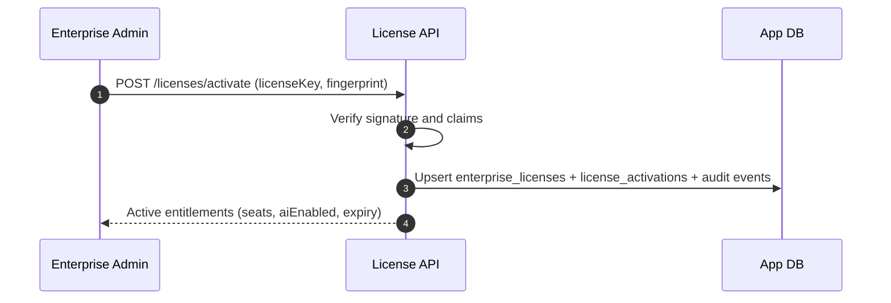

# System Design Flow

This document is a visual map of how DataFlow Studio works today, with focus on API-first delivery and runtime commercial modes.

## 1) Platform architecture

## 2) Runtime mode gate

## 3) OAuth sign-in flow

## 4) Query execution flow

## 5) AI generation/explain flow

## 6) Billing and licensing flows

